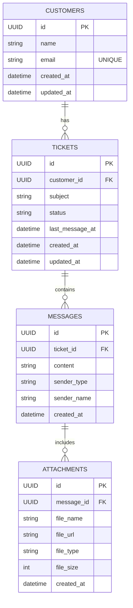

# React + TypeScript + Vite + shadcn/ui

This is a template for a new Vite project with React, TypeScript, and shadcn/ui.

# Database Schema (ERD)

**Relationships:**

- One Customer can have many Tickets (1:N)
- One Ticket can have many Messages (1:N)
- One Message can have many Attachments (1:N)

**Enums:**

- Ticket Status: `open`, `pending`, `resolved`, `closed`
- Sender Type: `customer`, `admin`
